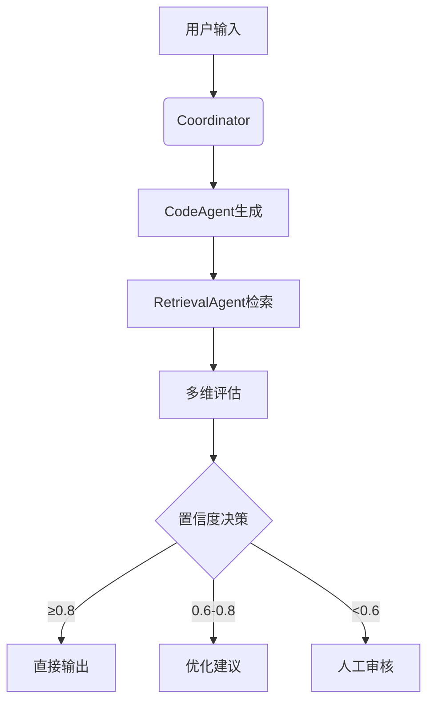

# 🚀 AutoOMP - 智能OpenMP并行化引擎

<div align="center">
  
  
  
</div>

 <!-- 还没替换为实际流程图 -->

**让并行化编程像呼吸一样自然！**  
基于多Agent架构的智能OpenMP代码生成系统，融合代码模式识别、语义保留评估与专家决策仲裁。

## ✨ 核心特性

### 🧠 多Agent智能协作
| Agent            | 超能力                          | 技术亮点                     |
|-------------------|--------------------------------|----------------------------|
| **CodeAgent**     | 精准模式识别                   | 深度代码语义理解            |
| **RetrievalAgent**| 代码库检索               | BGE-M3向量嵌入             |
| **Evaluation**    | 三维量化评估                   | AST结构相似度算法          |
| **Correction**    | 动态决策仲裁                   | 置信度驱动优化策略          |

### ⚡ 性能优势
- **智能并行预测**：90%+循环结构识别准确率
- **代码保真度**：>90% AST结构保留率
- **检索响应**：毫秒级相似代码匹配

<br>
<br>

## 🛠️ 快速开始

### 环境配置
```bash
# 克隆项目
git clone https://github.com/yyhchen/OpenMP_Agent_System.git
cd code

# 安装依赖
pip install -r requirements.txt

# 配置环境变量（.env文件）
echo "API_KEY=your_zhipuai_api_key" > .env
```


### 代码示例
```c
// 输入代码
for (int i=0; i<1e6; i++) {
    data[i] = complex_computation(data[i]);
}

// 输出结果
#pragma omp parallel for private(i) schedule(dynamic)
for (int i=0; i<1e6; i++) {
    data[i] = complex_computation(data[i]);
}
```


<br>
<br>


## 🧩 技术架构


<br>
<br>

## 🌐 技术栈
- **AI框架**: AutoGen, LangChain
- **模型**: GLM-4-Plus, BGE-M3
- **分析工具**: PyCParser, ASTComparator
- **数据库**: Chroma向量数据库


<br>
<br>


## 📈 性能基准
> 还没测试

| 测试集       | 保真度 | 正确性 | 平均耗时 |
|-------------|-------|-------|---------|
| PolyBench   | ----% | ----% | ---s    |
| NAS Parallel| ----% | ----% | ---s    |
| 自定义代码   | ----% | ----% | ---s    |


<br>
<br>


---
<div align="center">
  🚀 让每一行代码都飞起来！ 🚀
</div>
